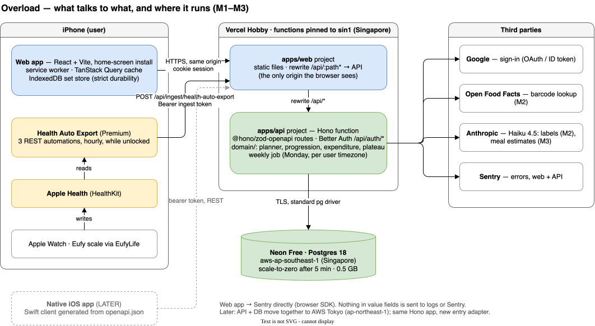

# 03 — Technical design

How Overload is built. Each choice here has its reasoning and rejected alternatives in
`docs/06-decision-log.md`; this document states what was decided and how the pieces fit. Where the
two disagree, `06` is older and this is the current reading. Tables and columns are in `docs/04`.

Written 2026-09-21. Vendor limits and prices were read from vendor pages on the dates given in `06`
or below.

---

## 1. Architecture



*`docs/diagrams/architecture.drawio.svg` answers one question: what talks to what, and where does
each piece run. Open it in draw.io to edit.*

- **Two clients, one backend.** The web app comes first and covers everything through M2, phone
  first. A native iOS app (SwiftUI) is LATER, probably arriving with M3, for the daily loop. Android
  is not planned.
- **The browser only ever talks to one origin.** The web app's Vercel project rewrites `/api/*` to
  the API project. Health Auto Export and the future native app use the same public URL.
- **The API is the only thing that touches the database or a third party.** The web app never calls
  Open Food Facts, Anthropic or Google directly. The one exception is Sentry, which the browser SDK
  reports to.
- **The API and the database are in the same region**, which today is Singapore. A request crosses
  Tokyo ↔ Singapore once, and the several queries behind it stay local.

### Native-ready rules (binding from day one)

The native app stays cheap only if these hold:

1. REST described by OpenAPI. No TypeScript-only RPC layer.
2. Planner, progression, expenditure and plateau logic run on the server, in `apps/api/src/domain/`.
3. Bearer tokens are accepted alongside cookies (Better Auth bearer plugin).
4. Rows created on the device carry client-generated UUIDv7 ids, and every write is safe to retry.

---

## 2. Stack

| Piece | Choice | Rejected |
| --- | --- | --- |
| Language | TypeScript, web and API | Go, Java/Spring Boot |
| Web app | React + Vite, client-only, installed to the home screen with a service worker. No SSR | Next.js, Nuxt, Vue + Vite, SvelteKit |
| API | Hono, routes defined with `@hono/zod-openapi` | Hono RPC client (`hc`) |
| Contract | `packages/api-contract/openapi.json`, generated by `getOpenAPI31Document()` from a script; web types by `openapi-typescript`. Committed | The web app importing server Zod schemas |
| Auth | Better Auth, Google only, invite allowlist via `user.validateUserInfo`, bearer plugin | — |
| Database | Postgres 18 (`uuidv7()` built in) | SQLite |
| Web data | TanStack Query, cache persisted to IndexedDB | — |
| Gym session state | One Zustand store, in memory | React Context, Redux |
| Unsent sets | Own IndexedDB store via `idb`, `durability: "strict"` | TanStack Query offline mutations |
| Ids | UUIDv7 everywhere: `uuid` v14 `v7()` on the phone, Postgres `uuidv7()` online | Serial ints, `crypto.randomUUID()` (v4) |
| Errors | RFC 9457 problem details; Sentry (`@sentry/hono`, browser SDK) | Vercel logs only |

---

## 3. Hosting and cost

### Where each piece runs

| Unit | Runs on | State |
| --- | --- | --- |
| Web app | Vercel Hobby, static files, project root `apps/web` | Stateless |
| API | Vercel Function, `sin1`, project root `apps/api` | Stateless |
| Daily job (§8.4) | Vercel Cron → an API route | Stateless; idempotent by table key |
| Database | Neon Free, `aws-ap-southeast-1`, Postgres 18 | The only state |
| Health export | Health Auto Export on each user's iPhone | On the phone |
| Nightly backup | GitHub Actions → S3, `ap-northeast-1` (`13` §2) | Encrypted dumps, 30 days |

**Later:** everything moves to Yuta's own AWS platform in Tokyo (`ap-northeast-1`). The API and the
database move together. The portability rules in `06` (2026-09-19, Hosting) make that a redeploy:
- no Vercel- or Neon-specific APIs
- all configuration in environment variables
- schema changed only by migration files, so `pg_dump`/restore is the whole data move

### Cost

| | Now (Yuta, plus a handful of invitees) | 1,000 users (hypothetical) |
| --- | --- | --- |
| Vercel | $0, Hobby | Hobby is non-commercial and capped at 1M invocations. Pro is $20/month per seat with $20 of included usage; invocations beyond 1M cost $0.60 per million |
| Neon | $0, Free: 0.5 GB, 100 CU-hours/month | Launch: $0.106/CU-hour, $0.35/GB-month. The compute would rarely sleep, so about 0.25 CU × 730 h ≈ 180 CU-hours ≈ $19, plus ~$1 of storage |
| Anthropic | A few cents a month: a label read is ~$0.002 on Haiku 4.5 | Labels ~$20/month at 10 per user. **Meal-photo cost is unmeasured** and gets measured in M3 before any invitee has S22 |
| Sentry | $0, Developer plan (one user) | A paid plan. Price not checked |
| Health Auto Export | ¥300/month (Premium), paid by each user on their own phone | Same, per user |
| **Total** | **$0 + Anthropic cents** | **≈ $40–60/month + Anthropic usage** |

- Vercel and Neon prices were read from vercel.com/pricing and neon.com/pricing on 2026-09-21.
- **1,000 users assumes:** about 100 requests per user per day (hourly health exports plus app use),
  which is ~3M invocations/month, and ~2 GB of rows after a year.
- **What breaks first under 10× today:**
  - Neon's 0.5 GB. Health samples are the largest table. At the daily grouping in §9, one user is
    roughly 3,000–4,000 rows a year, so Free lasts for a small group but not for a crowd.
  - Hobby's non-commercial clause, the moment any money changes hands.

---

## 4. External services, and what happens when each is down

| Service | Used for | When it is down or slow |
| --- | --- | --- |
| Google | Sign-in | Existing sessions keep working. New sign-in shows an inline message |
| Neon | Everything | Scale-to-zero wake takes "a few hundred ms". The API retries once, then treats it as API unreachable. The gym screen keeps logging to the device |
| Open Food Facts (M2) | Barcode lookup. 15 reads/min per IP; User-Agent `Overload/<version> (<contact>)` | Inline message offering a label photo or manual entry |
| Anthropic, Haiku 4.5 (M2 labels, M3 estimates) | Label extraction as schema-checked JSON; meal estimates | The manual form opens, pre-filled with anything already read |
| Health Auto Export (M3; weight in M2 if chosen) | Apple Health → API | Nothing to show at the moment of failure. `health_sync_state` makes a dead sync visible on the dashboard (S19). "Previous 7 Days" re-sends missed days on the next run |
| Sentry | Error tracking | Events are dropped. The app is unaffected |
| Vercel | Hosting | The installed app shell still opens from the service worker. The gym screen works offline; the rest shows cached data with its age |

---

## 5. Repo layout

pnpm workspaces, one repo. The web and API deploy as two Vercel projects from it.

```
apps/web/               React + Vite, service worker, IndexedDB set store
apps/api/               Hono app; thin entry adapters (Vercel now, Node, later Lambda)
  src/routes/             one file per resource, @hono/zod-openapi
  src/domain/             planner, progression, trend, expenditure, plateau catalogue (pure)
  src/db/                 query layer; every query takes the session user
  migrations/             versioned SQL, the only way the schema changes
  seed/                   MEXT 八訂 増補2023 import
packages/api-contract/  generated openapi.json + TS types, committed
ios/                    reserved for the native app
design/  docs/  CONTEXT.md
```

- The web app imports `api-contract` only, never `apps/api`.
- `apps/web/vercel.ts` rewrites `/api/*` to the API project, with the target read from `API_ORIGIN`
  at build time so staging reaches the staging API (`12` §1). Static `vercel.json` cannot do that.
- Better Auth `baseURL` is the web origin, so the Google callback returns through the rewrite.
  This is the fix for Safari blocking cookies across two `*.vercel.app` sites (see `06`).
- Every API response sends `Cache-Control: private, no-store`. Vercel rewrites honour upstream
  cache headers for projects created on or after 2026-04-06.

---

## 6. State

| State | Lives in | Rule |
| --- | --- | --- |
| API data | TanStack Query, persisted to IndexedDB | Screens render the last loaded data offline, with its age |
| Unsent and refused sets | Our IndexedDB store, one record per set keyed by its id, `durability: "strict"` | Written the moment the set is logged. Deleted only after the server confirms |
| Active gym session | One Zustand store, in memory | The rest timer stores when rest *started* (the last set's timestamp), never a countdown |
| One screen's inputs, open tab | React state, plus the URL for anything worth linking | — |
| Server truth | Postgres | — |

**One copy per fact.** Server data never goes into Zustand.

---

## 7. Errors and logging

### What the user sees

1. **No signal is not an error.** Sets queue on the device. The app bar's data-state slot
   (`docs/10` §7.4) shows the pending count, and other screens show cached data with its age.
2. **A service is down or slow.** An inline message at the point of action, always with a way
   forward (§4).
3. **The server refuses the data** (validation failed, access revoked). The item stays in the queue,
   marked refused in the error colour, and can be edited or discarded. **A set is never dropped
   silently.**

The error colour is `error` `#F2555A` (`docs/05` §1.4, added 2026-09-22), always with the word and an icon.

### API

- Every error is an RFC 9457 problem detail: `type`, `title`, `status`, `detail`, plus our `code`.
- A retried write with the same id returns the original result, not a duplicate and not an error.

### Logging

- One structured JSON line per request in Vercel's function logs, with a request id.
- Stack traces for kind 3 and for every 5xx.
- **Never logged or sent to Sentry:** food, weight or health values, meal or label photos, tokens,
  email addresses. Log ids and error codes only.
- Sentry: user info off, no HTTP bodies, and `beforeSend` strips any value field. On Vercel,
  `@sentry/hono` must flush before the function returns.

---

## 8. The three hardest problems

### 8.1 Exactly-once set upload (S1)

1. Logging a set writes it to the IndexedDB store at once with a UUIDv7 made on the phone, and
   only then updates the screen.
2. The uploader sends queued sets whenever the app is open and has signal. It does not depend on
   Background Sync, which is unverified on Safari.
3. The server upserts with `INSERT … ON CONFLICT (id) DO UPDATE … WHERE stored.client_updated_at <
   incoming.client_updated_at` and returns a result per row (`docs/07` §3.4). A retry after a lost
   response, or a stale copy, changes nothing. Edits and deletes made offline travel in the same
   batch. *Changed 2026-09-21* from `DO NOTHING`, which could not carry an offline edit.
4. **The local record is deleted only after the server acknowledges the set.** A refusal (kind 3)
   marks it refused and keeps it.
5. **One tab uploads at a time.** Use the Web Locks API (`navigator.locks.request`) around the
   upload loop.
   - **Unverified:** Safari support. Check it when S1 is built.
   - A second tab uploading anyway is safe because of step 3; the lock only prevents wasted requests.
6. `workout` and `workout_exercise` are created on the phone the same way, and uploaded before
   their sets.

**Tests:** browser tests in airplane mode:
- log, kill the tab, reopen, then reconnect
- the same set sent twice
- the server returns 422 for one set in a batch
- two tabs open

### 8.2 Meal planner (S16)

- A pure, deterministic function in `domain/`: the same food list, targets, day type and rotation
  state always give the same plan.
- **Targets:**
  - calories within ±5% of the target, protein within ±5 g
  - portions rounded to 5 g, eggs and other `piece_weight_g` foods whole
  - protein spread at 0.4–0.55 g/kg per meal across the meal count
  - carbohydrate timed around the training slot on training days
- Rotation picks from a `rotation_group`, not a chain of pairs.
- **Whether to use a solver library or hand-written code is decided when M2 starts.** The function's
  signature and the tolerance tests are written first, so the choice can be swapped.
- If the tolerance cannot be met with the food list, the planner returns the closest plan and names
  which target it missed. It never returns nothing.

### 8.3 Weight trend and expenditure (S11, S18a, S21, S23), method `weight_trend_balance_v1`

**The day's weight** is derived:
1. the first reading before 10:00 in `user_profile.timezone`
2. failing that, the day's first reading, flagged as not a morning weigh-in

**The trend** is a time-aware exponentially weighted moving average, 10% per day:

```
a        = 1 − 0.9^Δd          Δd = days since the previous weighed day (1 if consecutive)
trend_t  = trend_prev + a · (w_t − trend_prev)
trend_1  = w_1
```

- The effective window is about 10 days. Missing days are handled by `Δd` rather than by
  interpolation, so a four-day gap moves the trend as much as four days of readings would.
- With fewer than 3 weighed days, raw points only and no trend line (PRD edge case).
- Computed in `domain/` at read time, never stored.

**Expenditure** over a window of `N` days, using complete days only (a day with every planned meal
confirmed, S18):

```
mean_intake   = Σ confirmed kcal on complete days ÷ complete_day_count
trend_delta   = trend(last day of window) − trend(day before window)       kg
tdee          = mean_intake − (trend_delta × 7,700) ÷ N                    kcal/day
```

- 7,700 kcal/kg is the conventional energy density of body-mass change. It is an approximation, and
  it is why `method` is versioned.
- **S18a (M2, read-only):** the same trailing 14 days as S21, shown once the user has 14 complete
  days in total. Before that it shows how many remain. If the newest 7 days hold fewer than 5
  complete days, the figure is labelled as resting on too little recent logging.
- **S21 (M3, weekly):** recomputed every local Monday over the **trailing 14 days**.
- **Applied only if the newest 7 days hold ≥ 5 complete days.** Otherwise the row is still written
  with `applied_at = NULL`, it is shown to the user, and the previous targets stay in force.
- **The new calorie target is clamped to ±150 kcal of the target in force** — the previous applied
  estimate's, or a target the user set by hand after it (`goal_phase.calorie_target_set_at`,
  `docs/09` F13).
  `estimated_tdee_kcal` is stored unclamped; only `target_kcal` is clamped. Macros follow the phase's
  protein rule, with fat and carbohydrate filling the rest.
- The first estimate of a phase has no previous target to clamp against, so it uses
  `goal_phase.calorie_target_kcal`.

**Plateau trigger (S23)** reads the trend's weekly rate against the phase's target rate. The number
of weeks is a property of each protocol in the typed catalogue in `domain/`.

### 8.4 The daily job

- Vercel Hobby allows one cron run per day, fired somewhere within the scheduled hour (Vercel cron
  docs, checked 2026-09-21).
- One cron runs at `0 15 * * *` UTC, which lands between 00:00 and 00:59 in Tokyo. For every user
  whose local Monday has begun and who has no `expenditure_estimate` for that `week_start`, it
  computes the estimate, applies it if eligible, and regenerates the week's unconfirmed plan days.
- `UNIQUE (user_id, week_start)` makes a re-run harmless.
- **If the cron is missed,** the first request after the local Monday that needs current targets
  runs the same function inline. The cron is an optimisation, not the only path.
- On Pro, or on AWS, it can run hourly without any change to the function.

---

## 9. Health ingest (M3; M2 weight if chosen)

### Health Auto Export setup — fixed at setup, recorded here

HAE Premium REST automations. Facts from its docs (help.healthyapps.dev, REST API automation page,
checked 2026-09-21):
- An automation with more than one metric is always aggregated.
- Summarize Data OFF gives individual points, but only for a single-metric automation.
- Auth is by custom headers.
- It runs only while the phone is unlocked, by Background App Refresh.

| Automation | Data | Summarize | Time grouping | Date range |
| --- | --- | --- | --- | --- |
| `overload-weight` | Weight (body mass) only | **OFF** | — | Previous 7 Days |
| `overload-daily` | Sleep analysis, resting heart rate, HRV, step count, active energy, body fat %, lean body mass | **ON** | **Days** | Previous 7 Days |
| `overload-workouts` | Workouts, Export Version 2, route and workout metrics OFF | — | — | Previous 7 Days |

All three automations use:
- **Format:** JSON, Batch Requests ON
- **Cadence:** hourly
- **Request:** `POST https://<web origin>/api/ingest/health-auto-export` with the header
  `Authorization: Bearer <ingest token>`

- **Why weight is on its own:** S11's "first reading before 10:00" rule needs every weigh-in.
- **Why everything else is daily:** one row per metric per day is what S20 and S24 read. Aggregated
  sleep arrives as one row per night with stages. It also keeps HAE's background run short: iOS gives
  background tasks about 30 s.
- **Why "Previous 7 Days":** every run re-sends a week. Apple's revisions and missed runs therefore
  arrive on the next successful run, and the upsert makes the repeats harmless.
- **Changing grouping later is a migration, not a toggle.** It changes what a row means and collides
  on `started_at`.
- **HRV is therefore one daily value**, not one row per reading. `docs/04`'s vocabulary is updated
  to match.
- **Body fat % and lean body mass arrive daily**, not per weigh-in, because they share the
  aggregated automation. They are stored as `health_sample` metrics `body_fat_percentage` and
  `lean_body_mass`. `body_measurement.body_fat_pct` and `lean_mass_kg` hold hand-entered values and,
  later, what a native HealthKit client reads per sample.
  - **Why not attach them to the day's weight row:** the weight and the daily automations arrive in
    no fixed order, so there may be no weight row yet to attach to.

### Ingest endpoint

- **Auth:** a per-user **ingest token**.
  - The user creates it on the health setup screen and it is shown once. Only its SHA-256 hash is
    stored (`ingest_token`, `docs/04`).
  - It authorises exactly one route, `POST /api/ingest/health-auto-export`, and nothing else.
  - It can be revoked, and revoking the invite revokes it too.
- **Writes:**
  - Metrics: `INSERT … ON CONFLICT (user_id, metric, started_at) DO UPDATE`
  - Workouts: `ON CONFLICT (user_id, external_id) DO UPDATE`
  - Weight: `body_measurement` keyed `(user_id, source, measured_at)`, also `DO UPDATE`
  - Then one `health_sync_state` upsert per metric present in the payload
- **Validation:**
  - The payload is Zod-validated like any route, and unknown metric names are ignored and counted.
  - The body limit is Vercel's function request limit, 4.5 MB (Vercel functions limits, checked
    2026-09-21). Batch Requests should keep each request well under it; confirm against the first
    real payloads.
- **Response:** 200 with counts. A 4xx makes HAE log a failure in its Activity Logs, which is where
  the user looks.

### Apple workout ↔ logged gym visit (S19)

- **At ingest,** a `health_workout` is linked to the `workout` whose span (first set to last set)
  overlaps it most. Two conditions must hold:
  - the overlap is at least 50% of the shorter of the two
  - the activity type is a strength type (Traditional or Functional Strength Training)

  Otherwise it stays unlinked. A linked row gets `link_source = 'auto'`.
- **The user can correct it** on the workout detail: unlink, or pick another Apple workout from that
  day. That sets `link_source = 'manual'`.
- **A manual choice is never overwritten.** The re-ingest upsert does not touch `workout_id` or
  `link_source` when `link_source = 'manual'`. Unlinking manually stores `workout_id = NULL` with
  `link_source = 'manual'`.
- If a gym visit is uploaded after its Apple workout arrived, matching runs again for unlinked,
  non-manual rows of that day.

---

## 10. Security baseline

| Question | Answer |
| --- | --- |
| **Where do secrets live?** | Vercel environment variables, with production and preview separate, plus a gitignored `.env.local`. Never in the repo, and nothing beyond public values in the web bundle. Secrets: DB URL, Better Auth secret, Google client secret, Anthropic key, Sentry DSN. Ingest tokens are stored hashed |
| **How is input validated?** | On the server, by the Zod schema on every route (the same schemas that generate OpenAPI). Client checks are only for UX. Label-photo output, Open Food Facts records and HAE payloads are untrusted input and go through the same schemas |
| **HTTPS everywhere?** | Yes. Vercel serves HTTPS only, and connections to Neon use TLS |
| **Sensitive data** | Email, bodyweight and composition, the food log, sleep, HRV, heart rate. Neon encrypts data at rest with AES-256 on its NVMe volumes (Neon security overview, checked 2026-09-21). None of it goes to logs or Sentry (§7). Label and meal photos go to Anthropic and are **discarded afterwards**; only confirmed values are stored |
| **Dependency updates** | Dependabot weekly, grouped. Security updates immediately |
| **Worst thing an attacker could do** | Read or change another user's data. The data layer takes the session user on every query rather than each route remembering to filter, and tests attempt cross-user reads and writes on every resource. The ingest token is scoped to one route |
| **Second worst** | Run up the Anthropic bill. Invite-only access, plus a dedicated `overload` Anthropic workspace with a $10/month hard limit (workspace limits verified 2026-09-21). Add a per-user daily label cap before the first invitee joins. Keys, roles, backups, audit trail and the incident plan: `13` |

---

## 11. Unverified, to check when the piece is built

- Web Locks API support in Safari home-screen apps (§8.1).
- When iOS ends a home-screen web app. The strict per-set write is the precaution.
- The latency the Vercel rewrite hop adds. Measure it in Vercel Observability once deployed.
- HAE batch sizes against Vercel's 4.5 MB request limit (the limit itself verified 2026-09-21).
- Whether Workouts v2 with workout metrics OFF still carries average and max heart rate. If not,
  turn on workout metrics at Minutes grouping for `overload-workouts` only.
- The Sentry Developer plan's monthly error allowance and retention.
- `swift-openapi-generator` specifics, when the native app starts.
- The M2 morning weight source. It is parked behind two hardware tests (`06`, 2026-09-19); if the
  Google Health API path wins, §9's `overload-weight` automation is not needed.
